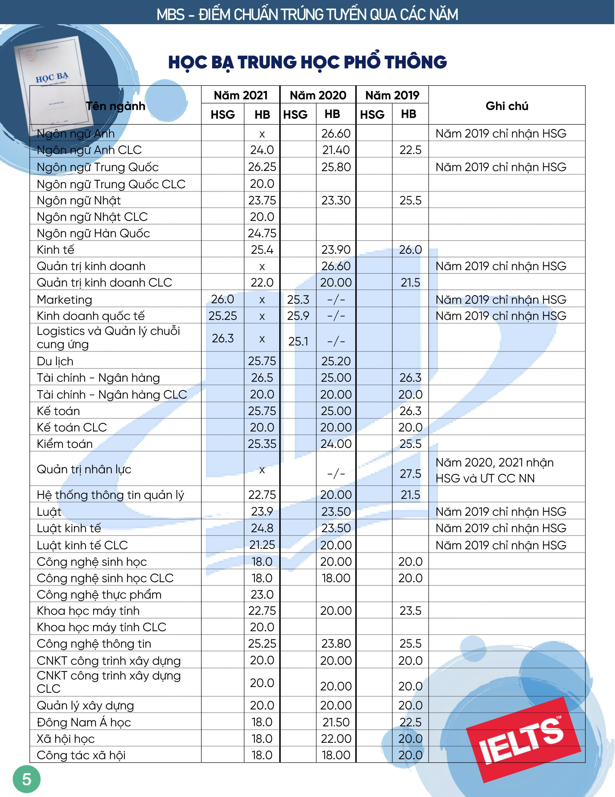

# Công cụ tính điểm xét tuyển

**Link web tính điểm:** [https://namnguyenthanhwork.github.io/oulink/tinh-diem-xet-tuyen.html](https://namnguyenthanhwork.github.io/oulink/tinh-diem-xet-tuyen.html)

**Link tổng hợp thông tin tuyển sinh:** [https://namnguyenthanhwork.github.io/oulink](https://namnguyenthanhwork.github.io/oulink?fbclid=IwAR2G9WqSqjkZ13eqTWZq6wvt2Szk\_NfB\_PYM7LggknmHAesIl49mEi2KmOk)

.png>)

.png>)

.png>)

.png>)


Link group

