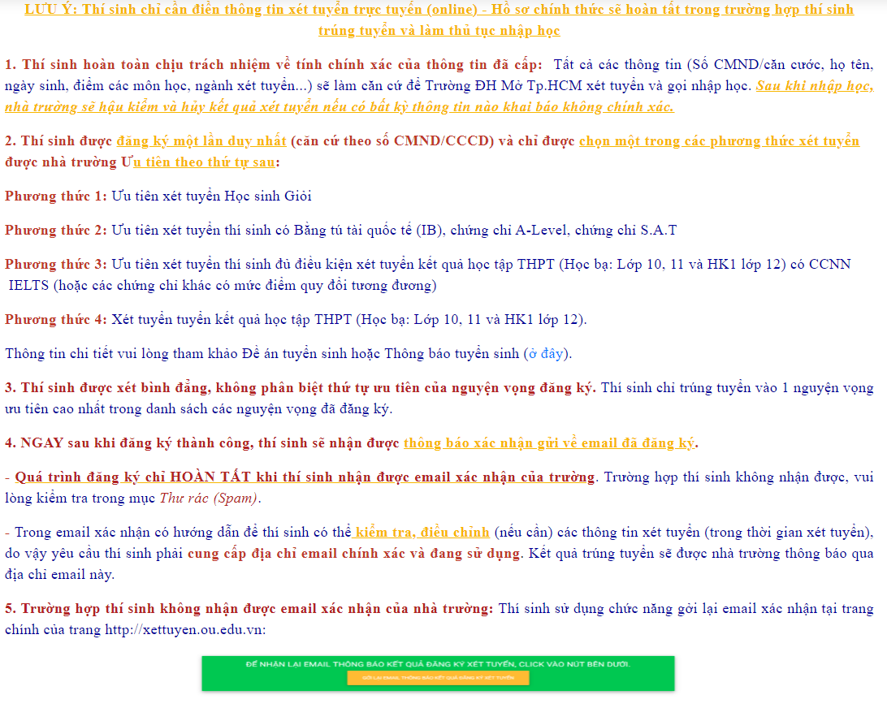

# Hướng dẫn đăng ký xét tuyển online

**Inbox Fanpage tư vấn tuyển sinh để được hỗ trợ:** [m.me/tuyensinh.ou.edu.vn](https://m.me/tuyensinh.ou.edu.vn)

**Website tuyển sinh:** [http://tuyensinh.ou.edu.vn/](http://tuyensinh.ou.edu.vn)


Lưu ý: bạn nên chọn phương thức xét phù hợp để nâng cao tỷ lệ trúng tuyển



Thời gian xét tuyển: thường xuyên theo dõi trong group ["Sinh viên Đại học Mở"](https://www.facebook.com/groups/oumembers)


## **Các phương thức xét tuyển**

### **Phương thức 3:** Ưu tiên xét tuyển đối với thí sinh **** bằng quốc tế


_Điều kiện đăng ký xét tuyển_:

1. Dựa trên bài thi tú tài quốc tế (IB) tổng điểm 26 trở lên.
2. Chứng chỉ quốc tế A-level của trung tâm khảo thí ĐH Cambridge (Anh) theo điểm 3 môn thi (trở lên) đảm bảo mức điểm mỗi môn thi đạt từ C trở lên.
3. Kết quả kỳ thi SAT đạt từ 1100/1600.


### **Phương thức 4:** Ưu tiên xét tuyển Học sinh Giỏi


_Điều kiện đăng ký xét tuyển_:

1. Học sinh tốt nghiệp THPT năm 2022;
2. Có hạnh kiểm tốt 02 năm lớp 10, lớp 11 và học kỳ 1 lớp 12;
3. Kết quả học lực 02 năm lớp 10, lớp 11 và học kỳ 1 năm lớp 12 đạt loại giỏi.
4. Điểm trung bình các môn học trong tổ hợp xét tuyển của cả năm lớp 10, lớp 11 và học kỳ 1 năm lớp 12 phải từ 7,0.


### **Phương thức 5:** Ưu tiên xét tuyển học bạ có chứng chỉ ngoại ngữ quốc tế


_Điều kiện đăng ký:_ thí sinh thỏa mãn cùng lúc 02 điều kiện

1. Thí sinh thỏa mãn các điều kiện của Phương thức 6;
2. Có chứng chỉ ngoại ngữ quốc tế trong thời hạn 02 năm:
   * Các ngành Ngôn ngữ: IELTS đạt 6.0 (hoặc các chứng chỉ khác tương đương – Tham khảo PL2).
   * Các ngành còn lại: IELTS đạt 5.5 (hoặc các chứng chỉ khác tương đương – Tham khảo PL2)**.**


 (1).png>)

### **Phương thức 6:** Xét tuyển theo kết quả học tập THPT


_Điều kiện đăng ký hồ sơ:_

Tổng Điểm trung bình môn học các môn trong tổ hợp xét tuyển (Điểm Đăng ký xét tuyển - không bao gồm điểm ưu tiên) phải đạt từ 18,00 điểm trở lên đối với các ngành Công nghệ sinh học (đại trà và chất lượng cao), Công tác xã hội, Xã hội học, Đông Nam Á học. Các ngành còn lại từ 20,00 điểm trở lên.


 (1).png>)

Nếu thấy công thức khó khăn, vui lòng vào[ "Công cụ tính điểm xét tuyển"](cong-cu-tinh-diem-xet-tuyen.md) để tính


**Chú ý:** thứ tự ưu tiên các phương thức&#x20;

<mark style="color:yellow;">**Phương thức 4 > Phương thức 3 > Phương thức 5 > Phương thức 6**</mark>


## Hướng dẫn đăng ký online

> <mark style="color:red;">**Lưu ý:**</mark> Đến đúng thời gian mở đăng ký, bạn truy cập vào trang xét tuyển để tiến hành đăng ký


**Bước 1:** Truy cập vào trang xét tuyển

Lưu ý: hãy chọn phương thức xét tuyển phù hợp để tăng tỷ lệ trúng tuyển



**Bước 2:** Điền thông tin cá nhân được ghi ở bên dưới



**Bước 3:** Nhập thông tin trường cấp 3 (3 năm học cấp 3)



**Bước 4:** Đăng ký nguyện vọng

Lưu ý: Không cần biết bạn có thật sự xét tuyển hay chỉ xét chơi, nên điền đúng điểm để khi có hối hận thì còn quay xe kịp thời. Nếu có sai xót thì không thể sửa điểm.



Bước 5: sau khi hoàn tất thì nhập email để nhận thông tin sau khi có kết quả trúng tuyển , kiểm tra lại email xem đã nhận được thông báo đăng ký thành công hay chưa



Tham gia group để cập nhật thông tin tuyển sinh mới nhất

