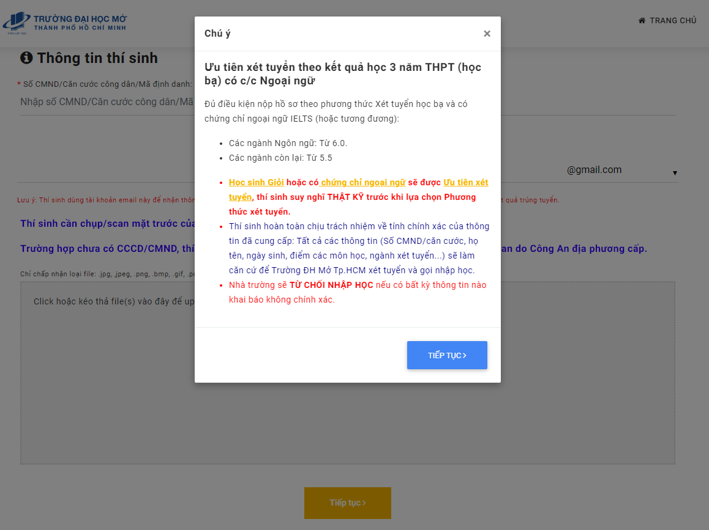

# ✏ Phương thức xét học bạ 3 năm THPT có chứng chỉ ngoại ngữ


**Lưu ý:** để thông tin sổ tay bạn nắm được luôn mới nhất, **sau khi truy cập vào sổ tay này, bạn vui lòng ấn F5 hoặc nút tải lại trang để cập nhật thông tin mới nhất** (vì sổ tay thường xuyên chỉnh sửa nên yêu cầu phải refesh để cập nhật, nếu không thì bạn vẫn đang ở phiên bản cũ, khi đọc có thể sai sót). <mark style="color:red;">**Bạn có thể đọc hướng dẫn cách tải lại trang web ở bên dưới.**</mark> Xin cảm ơn !!!



[huong-dan-tai-lai-trang-so-tay-sinh-vien-ou.md](../../huong-dan-khac/huong-dan-tai-lai-trang-so-tay-sinh-vien-ou.md)


🔗**Link đăng ký xét tuyển học bạ 2022:** [https://xettuyen.ou.edu.vn/hb2022d1/vi](https://xettuyen.ou.edu.vn/hb2022d1/vi)

**⌚ Thời gian xét tuyển:** Từ 09g00 ngày 04/04/2022 đến 17g00 ngày 30/05/2022&#x20;

**📌 Hình thức xét:** online (chỉ nhận hồ sơ khi có kết quả trúng tuyển)

**📌 Lệ phí xét tuyển:** miễn phí

**🌐** **Website tính điểm xét tuyển (tham khảo):** [https://oucommunity.github.io/sinh-vien-dai-hoc-mo-tphcm/tinh-diem-xet-tuyen](https://oucommunity.github.io/sinh-vien-dai-hoc-mo-tphcm/tinh-diem-xet-tuyen)

**🌐** **Website tổng hợp thông tin tuyển sinh (tham khảo):** [https://oucommunity.github.io/sinh-vien-dai-hoc-mo-tphcm](https://oucommunity.github.io/sinh-vien-dai-hoc-mo-tphcm/)

## **Bước 1: Chọn mục xét tuyển theo kết quả học THPT (học bạ) có chứng chỉ ngoại ngữ**

.PNG>)


**1 bảng thông báo giới thiệu sẽ hiện ra, nhớ đọc kỹ rồi hãy ấn tiếp tục**


## **Bước 2: Điền thông tin**


* [x] 2.1. Điền CCCD/CMND hoặc mã định danh **(chỉ chọn 1 trong 3 thứ được đề cập)**
* [x] 2.2. Điền email (email nhận xác nhận - nhận thông báo đăng ký thành công)
* [x] 2.3. **Chụp mặt trước CCCD/CMND** sau đó upload lên (nên sài máy tính để dễ thao tác hơn, không khuyến khích sử dụng điện thoại vì không tối ưu khi đăng ký)


## **Bước 3: Điền thông tin cá nhân**


**Điền thông tin cá nhân gồm:**

* [x] Họ và tên **(có 2 ô nên ô 1 điền họ + tên lót, ô 2 điền tên)**
* [x] Giới tính
* [x] Ngày tháng năm sinh
* [x] Nơi sinh
* [x] Dân tộc
* [x] Điện thoại liên lạc
* [x] Địa chỉ báo tin (địa chỉ nhà) - **có thể điền hoặc không, không bắt buộc**


## **Bước 4: điền thông tin trường**


**Điền thông tin trường (3 năm học cấp 3)**

* [x] Điền tỉnh
* [x] Điền tên trường
* [x] Điền năm tốt nghiệp THPT **(Đối với thí sinh lớp 12 thì điền năm hiện tại, hoặc điền năm đã tốt nghiệp đối với các thí sinh tốt nghiệp năm cũ)**
*   [x] Điền khu vực ưu tiên theo trường THPT nếu hệ thống không tự điền sẵn

    * **Khu vực 1 (KV1)**: **Cộng ưu tiên 0,75 điểm**
    * **Khu vực 2 (KV2):** **Cộng ưu tiên 0,25 điểm**
    * **Khu vực 2 nông thôn (KV2-NT): Cộng ưu tiên 0,5 điểm**&#x20;
    * **Khu vực 3: Không được cộng điểm ưu tiên**&#x20;

    **Hoặc đọc khu vực ưu tiên được để bên dưới (ấn vào rồi đọc nhé)**
* [x] Điền đối tượng ưu tiên (<mark style="color:red;">**đọc đối tượng ưu tiên ở bên dưới**</mark>** ** trước khi chọn, nếu không thuộc loại nào thì điền **"**<mark style="color:red;">**Không ưu tiên**</mark>**"**)
  1. **Nhóm ưu tiên 1 (UT1) gồm 4 đối tượng: Được cộng 2 điểm**
     * **Đối tượng 01:**
     * **Đối tượng 04:**
  2. **Nhóm ưu tiên 2 (UT2) gồm các đối tượng: Được cộng 1 điểm**
     * **Đối tượng 06**
     * **Đối tượng 07**
* [x] Mục thay đổi khu vực ưu tiên theo hộ gia đình có nên tick hay không thì xin vui lòng đọc quy chế tuyển sinh được để bên dưới, **đọc kỹ Điều 7 khoản 4 điểm b của quy chế tuyển sinh (xem bên dưới)**


> <mark style="color:red;">**Đọc khu vực ưu tiên - Đối tượng ưu tiên ở bên dưới (ấn chọn)đối**</mark>


[khu-vuc-uu-tien.md](../quy-che-tuyen-sinh/khu-vuc-uu-tien.md)



[doi-tuong-uu-tien.md](../quy-che-tuyen-sinh/doi-tuong-uu-tien.md)



**Lưu ý:** đọc quy định thay đổi khu vực ưu tiên **(bên dưới)** sau đó nếu thấy hộ gia đình thuộc dạng được đề cập trong quy chế thì ấn tick chọn rồi nhập các thông tin như bên dưới <mark style="color:red;">**(chụp toàn bộ ảnh hộ khẩu)**</mark>, nếu không thì bỏ tick chọn và ấn tiếp tục. <mark style="color:red;">**(Nếu tick chọn sai thì coi như từ chối nhập học)**</mark>


**Điều 7. Chính sách ưu tiên trong tuyển sinh**

**Khoản 4: Chính sách ưu tiên theo khu vực**&#x20;


**Điểm a (Khu vực theo trường):**&#x20;

Thí sinh học liên tục và tốt nghiệp trung học tại khu vực nào thì hưởng ưu tiên theo khu vực đó. Nếu trong 3 năm học THPT (hoặc trong thời gian học trung cấp) có chuyển trường thì thời gian học ở khu vực nào lâu hơn được hưởng ưu tiên theo khu vực đó. Nếu mỗi năm học một trường thuộc các khu vực có mức ưu tiên khác nhau hoặc nửa thời gian học ở trường này, nửa thời gian học ở trường kia thì tốt nghiệp ở khu vực nào, hưởng ưu tiên theo khu vực đó. Quy định này áp dụng cho tất cả thí sinh, kể cả thí sinh đã tốt nghiệp từ trước năm tuyển sinh.&#x20;



**Điểm b - khu vực theo hộ gia đình (đọc kỹ điểm này để đưa ra quyết định có nên tick chọn vào ô thay đổi hay không - nếu tick sai coi như bạn điền sai thông tin -> đánh rớt)**

Các trường hợp sau đây được hưởng ưu tiên khu vực theo hộ khẩu thường trú:

* Học sinh các trường phổ thông dân tộc nội trú;
* Học sinh các trường, lớp dự bị ĐH;
* Học sinh các lớp tạo nguồn được mở theo quyết định của các Bộ, cơ quan ngang Bộ hoặc UBND cấp tỉnh;
* Học sinh có hộ khẩu thường trú (trong thời gian học THPT hoặc trung cấp) trên **18 tháng tại các xã khu vực III và các xã có thôn đặc biệt khó khăn thuộc vùng dân tộc và miền núi** theo quy định của Bộ trưởng, Chủ nhiệm Ủy ban Dân tộc; các xã đặc biệt khó khăn vùng bãi ngang ven biển và hải đảo; các xã đặc biệt khó khăn, xã biên giới, xã an toàn khu vào diện đầu tư của Chương trình 135 theo quy định của Thủ tướng Chính phủ nếu học THPT (hoặc trung cấp) tại địa điểm thuộc huyện, thị xã có ít nhất một trong các xã thuộc diện nói trên; **(download file phía dưới, Ctrl + F để tìm khu vực hoặc điểm trường của mình)**
* Quân nhân; sĩ quan, hạ sĩ quan, chiến sĩ nghĩa vụ trong Công an nhân dân được cử đi dự thi, nếu đóng quân từ 18 tháng trở lên tại khu vực nào thì hưởng ưu tiên theo khu vực đó hoặc theo hộ khẩu thường trú trước khi nhập ngũ, tùy theo khu vực nào có mức ưu tiên cao hơn; nếu dưới 18 tháng thì hưởng ưu tiên khu vực theo hộ khẩu thường trú trước khi nhập ngũ.



danh mục xã khó khăn 2021 - 2025



danh sách khu vực ưu tiên điểm trường thpt


## **Bước 5: Đăng ký nguyện vọng**


**Đăng ký nguyện vọng**

* [x] Chọn ngành và tổ hợp môn.
* [x] Điền chứng chỉ ngoại ngữ (bắt buộc) và điền thông tin điểm số.
* [x] Điền điểm trung bình môn (điểm cột cả năm 10, 11 và hk1 năm 12).&#x20;

**Các nguyện vọng 2 và 3 tương tự**


**Nếu chọn ưu tiên chứng chỉ tiếng anh thì chọn tổ hợp chứa tiếng anh, sau đó chọn chứng chỉ và điền điểm, sau đó điền điểm 2 môn còn lại**

**Nếu chọn ưu tiên chứng chỉ tiếng trung thì chọn tổ hợp chứa tiếng trung, sau đó chọn chứng chỉ và điền điểm, sau đó điền điểm 2 môn còn lại**

**Nếu chọn ưu tiên chứng chỉ tiếng nhật thì chọn tổ hợp chứa tiếng nhật, sau đó chọn chứng chỉ và điền điểm, sau đó điền điểm 2 môn còn lại**

**Lưu ý:** điểm trung bình ở trên là điểm trung bình của cả năm 10 11 và hk1 năm 12. Tổng điểm chỉ là tổng điểm trung bình của 3 môn đó **(chưa áp dụng công thức, chưa nhân hệ số và chưa cộng điểm ưu tiên). Khi có kết quả trúng tuyển thì mới áp dụng công thức.**


**Lưu ý:** nếu gặp lỗi như bên dưới, hoặc khi chỉnh sửa lại mà báo lỗi như hình thì vui lòng đăng ký phương thức xét học bạ thông thường chọn mục chứng chỉ ưu tiên. Nó sẽ thay thế phương thức này, vẫn xét ưu tiên theo diện có chứng chỉ ngoại ngữ


## **Bước 6: Kiểm tra thông tin, sau đó ấn lưu và nộp hồ sơ**


**Kiểm tra thông tin, sau đó ấn lưu và nộp hồ sơ**



**Hồ sơ gửi thành công, vào thư đến hoặc thư rác để kiểm tra**


## Chỉnh sửa thông tin đăng ký xét học bạ


**Thông tin đăng ký thành công**

**Lưu ý:** in kết quả đăng ký khi có thông báo trúng tuyển, nếu bạn có điền sai thông tin, muốn chỉnh sửa hoặc thêm - bớt nguyện vọng thì ấn chọn **sửa kết quả đăng ký xét tuyển**



**Chỉnh sửa và ấn lưu, khi có thông báo bên dưới là đã thành công**


.PNG>)

## Khắc phục lỗi khi mail không đến sau khi đăng ký hoàn tất


**Khi không có email trường gửi sau khi bạn đã đăng ký online, kiểm tra không có, vui lòng vào lại web xét tuyển, ấn gửi lại email nhiều lần, kiểm tra lại hộp thư đến và thư rác (spam), ấn gửi cho đến khi nhận được thì dừng**


## Đổi mail đăng ký xét tuyển khi ghi sai địa chỉ mail

## Chỉnh sửa - đổi phương thức xét tuyển


**Trong trường hợp chọn sai phương thức xét tuyển, muốn chuyển phương thức xét tuyển thì làm theo các bước dưới đây**


**Bước 1: tìm đến mail đăng ký thành công, ấn nút chuyển tiếp (forward)**

**Bước 2: lấy email đăng ký xét online, gửi mail đến **_<mark style="color:red;">**duy.nhv@ou.edu.vn**</mark>_** với nội dung như trong hình**


**Sau khi gửi xong, bạn đợi ban tuyển sinh phản hồi lại, khi có phản hồi thành công thì bạn có thể thực hiện đăng ký xét tuyển online lại như ban đầu (Đọc lại hướng dẫn này để đăng ký cho chính xác nhé)**



Tham gia vào nhóm đê ^\_^

