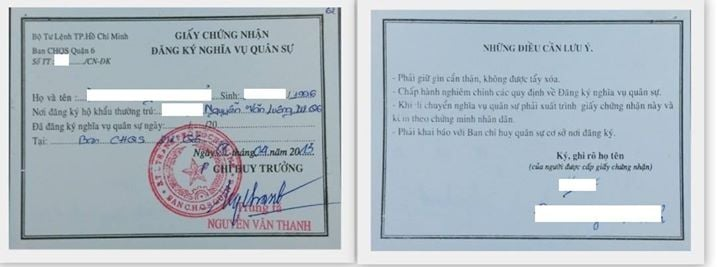

# 📑 Hướng dẫn đăng ký nguyện vọng trên Cổng thông tin Bộ GD&ĐT


**Lưu ý:** để thông tin sổ tay bạn nắm được luôn mới nhất, **sau khi truy cập vào sổ tay này, bạn vui lòng ấn F5 hoặc nút tải lại trang để cập nhật thông tin mới nhất** (vì sổ tay thường xuyên chỉnh sửa nên yêu cầu phải refesh để cập nhật, nếu không thì bạn vẫn đang ở phiên bản cũ, khi đọc có thể sai sót). <mark style="color:red;">**Bạn có thể đọc hướng dẫn cách tải lại trang web ở bên dưới.**</mark> Xin cảm ơn !!!



[huong-dan-tai-lai-trang-so-tay-sinh-vien-ou.md](../huong-dan-khac/huong-dan-tai-lai-trang-so-tay-sinh-vien-ou.md)


### I. Kiểm tra học bạ THPT và báo sai sót

**Bước 1:** Thí sinh **đăng nhập vào hệ thống => Nhấn Tra cứu => Nhấn Học bạ THPT**

.png>)

**Bước 2:** Thí sinh thực hiện xem điểm học bạ, nhấn vào lớp chọn Lớp 10, Lớp 11, Lớp 12 để xem học bạ các năm học

.png>)

**Bước 3:** Sau khi xem điểm học bạ nếu thí sinh thấy có sai sót thì nhấn **Báo sai sót**

❗ **Lưu ý:** Nút báo sai sót sử dụng để báo sai sót cho cả 3 năm học. Nếu thí sinh thấy có sai sót cả 3 năm học thì thực hiện báo sai sót cùng 1 lần)

.png>)

**Bước 4:** Sau khi nhấn **Báo sai sót** sẽ hiển thị màn hình để thí sinh nhập thông tin sai sót. Thí sinh nhập

Ví dụ: Sai thông tin Học lực học kì 1, sai thông tin điểm môn Toán học kì 1 lớp 12, môn Văn cuối năm lớp 11. Sau đó nhấn **Gửi phản ánh**

.png>)

### II. Danh sách nguyên vọng đủ điều kiện trúng tuyển

**Bước 1:** Thí sinh **đăng nhập tài khoản => Nhấn Tra cứu => Nhấn Danh sách nguyện vọng đủ điều kiện trúng tuyển**

.png>)

**Bước 2:** Thí sinh có thể tìm kiếm theo **Mã trường, Mã ngành** bằng cách nhập các thông tin vào và nhấn tìm kiếm

.png>)

### III. Đăng ký thông tin xét tuyển sinh

#### **1. Nhập thông tin xét tuyển sinh**

**Bước 1:** Thí sinh **đăng nhập vào hệ thống => Nhấn Đăng ký thông tin xét tuyển sinh**

.png>)

**Bước 2:** Chọn đối tượng ưu tiên tuyển sinh (nếu có)

.png>)

**Bước 3:** Nhấn **Nhập minh chứng đối tượng ưu tiên**

.png>)

**Bước 4:** Màn hình chọn ảnh hiển thị. Nhấn giữ phím **“Ctrl”** trên bàn phím và nhấn chuột phải vào các ảnh cần chọn (những ảnh được chọn sẽ hiển thị được bôi đen) sau khi chọn ảnh xong thí sinh nhấn **Open** để tải ảnh lên

.png>)

**Bước 5:** Nhấn **Nhập minh chứng khu vực**

.png>)

**Bước 6:** Màn hình chọn ảnh hiển thị. Nhấn giữ phím **“Ctrl”** trên bàn phím và nhấn chuột phải vào các ảnh cần chọn (những ảnh được chọn sẽ hiển thị được bôi đen) sau khi chọn ảnh xong thí sinh nhấn **Open** để tải ảnh lên

.png>)

**Bước 7:** Nhấn **Lưu thông tin đăng ký xét tuyển sinh**\

.png>)

#### **2. Thêm nguyện vọng**

#### **Bước 1:** Thí sinh nhấn **Thêm nguyện vọng**

.png>)

**Bước 2:** Thí sinh thực hiện nhập các thông tin nguyện vọng bao gồm **Thứ tự NV, Trường, Ngành, Phương thức xét tuyển, Tổ hợp môn => Sau đó nhấn Chọn để thêm nguyện vọng**

❗ **Lưu ý:** Sau khi **Thêm nguyện vọng** thí sinh nhấn **Lưu thông tin** để lưu thông tin vừa thêm

.png>)

**3. Sửa nguyện vọng**

**Bước 1:** Nhấn **Sửa nguyện vọng** tại nguyện vọng cần sửa

.png>)

**Bước 2:** Thí sinh thực hiện sửa các thông tin cần sửa sau đó nhấn Chọn để sửa nguyện vọng

❗ **Lưu ý:** Sau khi **Sửa nguyện vọng** thí sinh nhấn **Lưu thông tin** để lưu thông tin vừa sửa

.png>)

**4. Xóa nguyện vọng**

**Bước 1:** Nhấn **Xóa nguyện vọng** tại nguyện vọng cần xóa

.png>)

**Bước 2:** Màn hình thông báo hỏi **“Bạn có muốn xóa lựa chọn này?”** hiển thị. Nhấn **Đồng ý** để xóa nguyện vọng

❗ **Lưu ý:** Sau khi **Xóa nguyện vọng** thí sinh nhấn **Lưu thông tin** để lưu thông tin vừa xóa

.png>)

**5. Xếp theo thứ tự nguyện vọng**

**Bước 1:** Nhấn **Xếp theo thứ tự nguyện vọng**

.png>)

**Bước 2:** Thí sinh thực hiện sửa thứ tự nguyện vọng mong muốn

❗ **Lưu ý:** Sau khi **Sửa thứ tự nguyện vọng** thí sinh nhấn **Lưu thông tin** để lưu thông tin vừa sửa\

.png>)

**6. Lưu thông tin**

**Bước 1:** Sau khi thi sinh **Thêm nguyện vọng, Sửa, Xóa, Xếp** theo thứ tự nguyện vọng nhấn **Lưu thông tin** để thực hiện lưu các thông tin vừa thay đổi.

.png>)

**Bước 2:** Thí sinh sử dụng **đúng số điện thoạ**i đã điền trong phiếu đăng ký dự thi và nhắn tin theo cú pháp **TSO gửi 6058 (1000đ/tin nhắn)** để nhận mã xác thực. Mã xác thực sẽ hết hiệu lực sau 30 phút kể từ khi nhận được tin nhắn.

**Ví dụ:** TSO 01000001 gửi 6058

Sau đó nhập mã xác thực được gửi về điện thoại rồi nhấn **Xác nhận đăng ký.**

.png>)

**Bước 3:** Nhấn nút **Đồng ý** để lưu thông tin

**7. Thanh toán**

Thí sinh xem trong tài liệu HDSD\_ThanhToanTrucTuyen

**8. In biên lai**

Sau khi thanh toán thành công thí sinh có thể thực hiện In biên lai bằng cách nhấn vào nút **In biên lai**

.png>)

**9. In danh sách**

Thí sinh nhấn **In danh sách** để thực hiện in danh sách các nguyện vọng

.png>)

**10. Lịch sử giao dịch**

Thí sinh nhấn vào **Lịch sử giao dịch** để xem giao dịch

### IV. File hướng dẫn 

📂 **File hướng dẫn đăng ký tuyển sinh Bộ GD&ĐT**




Tham gia group đê


**🌐** **Trang tin tức Cộng đồng Sinh viên Đại học Mở Tp.HCM:** [https://tintuc.oucommunity.dev/](https://tintuc.oucommunity.dev/)

**🌐** **Website tính điểm xét tuyển học bạ THPT:** [https://www.oucommunity.dev/tinh-diem-xet-tuyen](https://www.oucommunity.dev/tinh-diem-xet-tuyen)

**🌐** **Website tổng hợp thông tin tuyển sinh:** [https://www.oucommunity.dev/](https://www.oucommunity.dev/)
