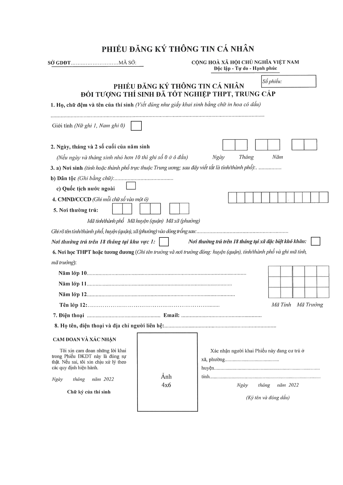

# 📑 \[Hướng dẫn] Thí sinh tự do xét tuyển học bạ đăng ký vào hệ thống quản lý thi của Bộ GD&ĐT


**Lưu ý:** để thông tin sổ tay bạn nắm được luôn mới nhất, **sau khi truy cập vào sổ tay này, bạn vui lòng ấn F5 hoặc nút tải lại trang để cập nhật thông tin mới nhất** (vì sổ tay thường xuyên chỉnh sửa nên yêu cầu phải refesh để cập nhật, nếu không thì bạn vẫn đang ở phiên bản cũ, khi đọc có thể sai sót). <mark style="color:red;">**Bạn có thể đọc hướng dẫn cách tải lại trang web ở bên dưới.**</mark> Xin cảm ơn !!!



[huong-dan-tai-lai-trang-so-tay-sinh-vien-ou.md](../huong-dan-khac/huong-dan-tai-lai-trang-so-tay-sinh-vien-ou.md)


❗ **** Để thuận tiện trong công tác xét tuyển sinh, các bạn nên tạo tài khoản xét tuyển <mark style="color:red;">**(bắt buộc)**</mark>** ** trên hệ thống của Bộ GD&ĐT bằng cách nộp hồ sơ.&#x20;

 **Thời gian mở đăng ký:** Từ ngày 12/07 đến ngày 18/07

📌 Đối tượng: Thí sinh đã tốt nghiệp THPT, trung cấp chưa có tài khoản đăng ký xét tuyển trên hệ thống của Bộ GD&ĐT

### Hướng dẫn đăng ký

* Thí sinh tải mẫu phiếu đăng ký thông tin cá nhân bên dưới và kê khai thông tin trên phiếu.
* Nộp phiếu tại điểm tiếp nhận (theo quy định và hướng dẫn của sở giáo dục và đào tạo nơi thí sinh thường trú) để nhận thông tin tài khoản phục vụ công tác tuyển sinh.

**👉 File phiếu đăng ký:** [Nhấn vào đây để tải về !](https://drive.google.com/file/d/1ut36w7zBqSr7HsrrWD31ql\_FVwJ2Qi7-/view?usp=sharing)

**📂 File công văn hướng dẫn tuyển sinh Bộ GD&ĐT**


**File công văn hướng dẫn tuyển sinh Bộ GD&ĐT**



Tham gia group đê


**🌐** **Trang tin tức Cộng đồng Sinh viên Đại học Mở Tp.HCM:** [https://tintuc.oucommunity.dev/](https://tintuc.oucommunity.dev/)

**🌐** **Website tính điểm xét tuyển học bạ THPT:** [https://www.oucommunity.dev/tinh-diem-xet-tuyen](https://www.oucommunity.dev/tinh-diem-xet-tuyen)

**🌐** **Website tổng hợp thông tin tuyển sinh:** [https://www.oucommunity.dev/](https://www.oucommunity.dev/)
