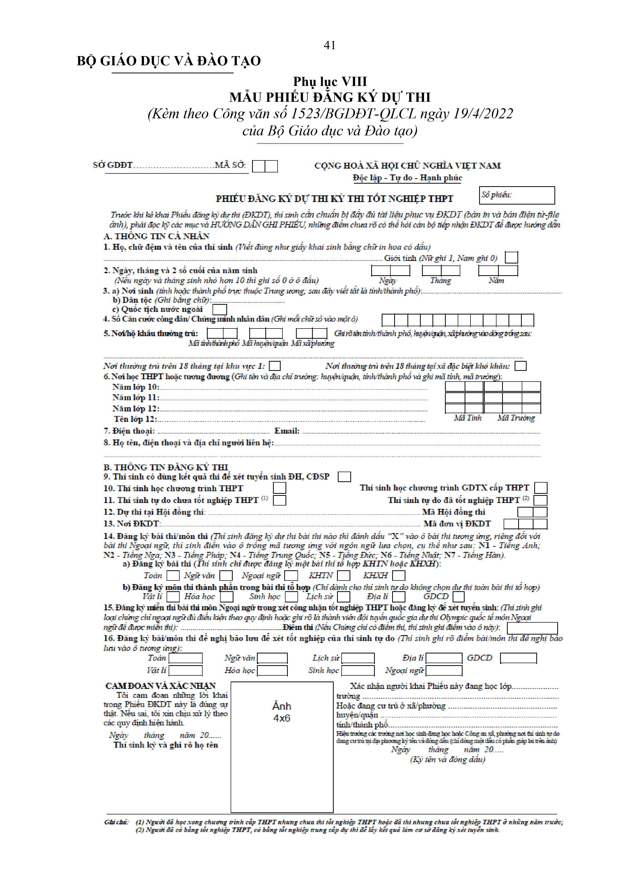

# 📑 \[Hướng dẫn] Thí sinh tự do xét tuyển học bạ đăng ký vào hệ thống quản lý thi của Bộ GD&ĐT

❗ **** Để thuận tiện trong công tác xét tuyển sinh, các bạn nên tạo tài khoản xét tuyển <mark style="color:red;">**(bắt buộc)**</mark>** ** trên hệ thống của Bộ GD&ĐT bằng cách nộp hồ sơ.&#x20;

 **Thời gian mở đăng ký:** Từ ngày 12/07 đến ngày 18/07


 **Cách thức nộp hồ sơ**

* Thí sinh tự do đăng ký dự thi và đăng ký xét công nhận tốt nghiệp trung học phổ thông (nếu có) trực tiếp tại đơn vị đăng ký dự thi do Sở Giáo dục và Đào tạo quy định.
* Thí sinh thi lại trung học phổ thông có thể mua hồ sơ tại các nhà sách lớn trên cả nước hoặc phòng Giáo dục quận/huyện, trung tâm giáo dục thường xuyên hoặc trường trung học phổ thông cũ mà mình đã theo học.
* Thí sinh tự do nộp hồ sơ tại các trung tâm giáo dục thường xuyên hoặc phòng giáo dục quận/huyện nơi thuận tiện nhất cho thí sinh.


### MẪU PHIẾU ĐĂNG KÝ DỰ THI (Kèm theo Công văn số 1523/BGDĐT-QLCL ngày 19/4/2022 của Bộ Giáo dục và Đào tạo)

### NHỮNG ĐIỂM CẦN LƯU Ý

1. Trước khi khai phiếu đăng ký dự thi (ĐKDT), thí sinh phải đọc kỹ các mục và bản HƯỚNG DẪN GHI PHIẾU, những điểm nào chưa rõ thí sinh phải hỏi cán bộ tiếp nhận ĐKDT để được hướng dẫn đầy đủ. Thí sinh phải hoàn toàn chịu trách nhiệm về thông tin khai trong Phiếu ĐKDT.
2. Thí sinh đang học lớp 12 thực hiện khai thông tin ĐKDT trực tuyến theo tài khoản được cấp trên Hệ thống phần mềm Quản lý thi. Sau khi hoàn thành rà soát và xác nhận theo thời hạn ĐKDT quy định, Trường THPT nơi thí sinh đang học in Phiếu ĐKDT, Phiếu số 1, Phiếu số 2 và ký tên, đóng một dấu có phần giáp lai lên ảnh của Phiếu ĐKDT để xác nhận nhân thân thí sinh.
3. Thí sinh tự do khai thông tin cần thiết trên bì đựng Phiếu ĐKDT, Phiếu số 1 và Phiếu số 2 (thông tin phải giống nhau ở tất cả các mục tương ứng trên bì, Phiếu số 1 và Phiếu số 2) rồi nộp cho nơi tiếp nhận đăng ký dự thi kèm theo bản sao (photocopy) 2 mặt CMNN/CCCD trên 1 mặt của tờ giấy A4 và 2 ảnh cỡ 4x6 kiểu chân dung, mới chụp trong vòng 6 tháng (có ghi rõ họ và tên, ngày, tháng, năm sinh, vào mặt sau tấm ảnh, 2 ảnh này đựng trong một phong bì nhỏ). Ngoài ra, phải dán thêm 1 ảnh vào vị trí đã xác định ở mặt trước túi đựng Phiếu ĐKDT. Công an xã phường nơi thí sinh tự do đang cư trú ký tên và đóng một dấu có phần giáp lai lên ảnh của Phiếu ĐKDT để xác nhận nhân thân thí sinh. Người đã có bằng tốt nghiệp THPT hoặc có bằng tốt nghiệp trung cấp dự thi để lấy kết quả thi tốt nghiệp THPT làm cơ sở để đăng ký xét tuyển sinh ĐH, CĐ phải điền tất cả các mục trên Phiếu. Người có bằng tốt nghiệp THPT hoặc có bằng tốt nghiệp trung cấp đăng ký nguyện vọng để xét tuyển bằng phương thức khác với phương thức xét tuyển bằng kết quả thi tốt nghiệp THPT phải khai từ mục 1 đến mục 11 và mục 13 trên Phiếu.
4. Nơi tiếp nhận ĐKDT giữ lại bì đựng Phiếu ĐKDT, Phiếu số 1, bản sao (photocopy) CCCD/CMND và 2 ảnh, trả lại Phiếu số 2 cho thí sinh sau khi đã ký và đóng dấu xác nhận.
5. Thí sinh lưu giữ Phiếu số 2 này để nhận Giấy báo thi, Giấy chứng nhận kết quả thi. Trong trường hợp có những sai sót thông tin đăng ký dự thi hoặc bị thất lạc Giấy báo thi thí sinh đem Phiếu ĐKDT này trực tiếp tới Điểm thi đã đăng ký vào buổi tập trung phổ biến quy chế để đề nghị sửa chữa sai sót và làm thủ tục dự thi


**Phiếu đăng ký xét tuyển số 1 & 2 (**<mark style="color:red;">**điền vào các mục 1 đến 13, trừ các mục 12 14 15 và 16 - không điền**</mark>**) - Các bạn có thể tải ảnh bên dưới về photocopy ra để điền nhé.**


**Phiếu số 1**

\_page-0003.jpg>)

**Phiếu số 2**

\_page-0004.jpg>)

### **HƯỚNG DẪN GHI PHIẾU ĐĂNG KÝ DỰ THI KỲ THI TỐT NGHIỆP THPT**

Mục SỞ GDĐT……… MÃ SỞ: Thí sinh đăng ký tại đơn vị đăng ký dự thi thuộc Sở GDĐT nào thì ghi tên Sở GDĐT vào vị trí trống, sau đó điền 2 chữ số biểu thị mã Sở GDĐT vào 2 ô trống tiếp theo, mã Sở GDĐT do Bộ GDĐT quy định.&#x20;

Mục Số phiếu: Nơi tiếp nhận đăng ký dự thi ghi, thí sinh không ghi mục này.&#x20;

Mục 1, 2: Ghi theo hướng dẫn trên Phiếu đăng ký dự thi kỳ thi tốt nghiệp THPT (sau đây gọi tắt là Phiếu ĐKDT).&#x20;

Mục 3: a) Nơi sinh của thí sinh chỉ cần ghi rõ tên tỉnh hoặc thành phố trực thuộc Trung ương (tỉnh/thành phố), nếu sinh ở nước ngoài thí sinh chỉ cần ghi rõ tên quốc gia (theo tiếng Việt Nam). b) Dân tộc ghi đúng theo giấy khai sinh. c) Quốc tịch nước ngoài thì đánh dấu (X) vào ô bên cạnh.&#x20;

Mục 4: Đối với CCCD hoặc CMND mẫu mới, ghi đủ 12 chữ số vào các ô tương ứng; đối với CMND mẫu cũ, ghi 9 chữ số vào 9 ô cuối bên phải, ba ô đầu để trống.&#x20;

Mục 5: Mã tỉnh/thành phố, mã huyện/quận và mã xã/phường chỉ đối với các xã/phường thuộc Khu vực 1 sẽ do Bộ GDĐT quy định. Thí sinh cần tra cứu tại nơi đăng ký dự thi để ghi đúng mã tỉnh/thành phố, mã huyện/quận, mã xã/phường nơi thí sinh có nơi/hộ khẩu thường trú hiện tại vào các ô tương ứng ở bên phải. Thí sinh không có nơi/hộ khẩu thường trú tại xã Khu vực 1 thì bỏ trống ô mã xã. Sau khi điền đủ các mã đơn vị hành chính vào các ô, thí sinh ghi rõ tên xã/phường, huyện/quận, tỉnh/thành phố vào dòng trống. Đối với thí sinh thuộc diện ưu tiên đối tượng hoặc khu vực có liên quan đến nơi thường trú/hộ khẩu thường trú, đề nghị phải khẳng định thời gian có nơi thường trú/hộ khẩu thường trú trên 18 tháng tại khu vực 1 hoặc trên 18 tháng ở xã đặc biệt khó khăn, xã có thôn đặc biệt khó khăn trong thời gian học THPT bằng cách đánh dấu vào ô tương ứng.&#x20;

Mục 6: Ghi tên trường và địa chỉ đến huyện/quận, tỉnh/thành phố của trường vào dòng kẻ chấm. Ghi mã tỉnh nơi trường đóng vào 2 ô đầu, ghi mã trường vào 3 ô tiếp theo (mã trường ghi theo quy định của Sở GDĐT, nếu mã trường có 1 chữ số thì 2 ô đầu tiên ghi số 0, nếu mã trường có 2 chữ số thì ô đầu tiên ghi số 0). Đối với thí sinh là công an, quân nhân được cử tham gia dự thi để xét tuyển ĐH, CĐSP thì ghi mã tỉnh/thành phố tương ứng với tỉnh nơi đóng quân và mã trường THPT là 900. Đối với thí sinh có thời gian học ở nước ngoài thì những năm học ở nước ngoài ghi mã tỉnh/thành phố tương ứng với tỉnh/thành phố theo nơi/hộ khẩu thường trú tại Việt Nam và mã trường THPT là 800. Mục tên lớp: ghi rõ tên lớp 12 nơi học sinh đang học (ví dụ 12A1, 12A2,...), đối với thí sinh tự do ghi “TDO”.

Mục 7: Ghi rõ điện thoại, email. Đối với thí sinh có yêu cầu điều chỉnh đăng ký xét tuyển tuyển sinh trực tuyến, cần đăng ký số điện thoại di động của mình để được cấp mật khẩu sử dụng một lần (OTP) qua tin nhắn đảm bảo cho sự bảo mật khi đăng ký xét tuyển trực tuyến.&#x20;

Mục 8: Thí sinh phải ghi rõ thông tin của người liên hệ: họ tên; số điện thoại; địa chỉ xóm (số nhà), thôn (đường phố, ngõ ngách), xã/phường, huyện/quận, tỉnh/thành phố. Địa chỉ này đồng thời là địa chỉ nhận Giấy báo trúng tuyển nếu thí sinh trúng tuyển.&#x20;

Mục 9: Thí sinh có nguyện vọng lấy kết quả dự thi để xét tuyển sinh đại học; cao đẳng ngành Giáo dục Mầm non thì đánh dấu (X) vào ô bên cạnh.&#x20;

Mục 10: Thí sinh bắt buộc phải đánh dấu (X) vào một trong 2 ô để biểu thị rõ thí sinh học theo chương trình THPT hay chương trình GDTX cấp THPT.46&#x20;

Mục 11: Đối với thí sinh tự do phải đánh dấu (X) vào một trong 2 ô để phân biệt rõ là thí sinh tự do chưa tốt nghiệp THPT hay đã tốt nghiệp THPT (tính đến thời điểm dự thi).&#x20;

Mục 12: Thí sinh đăng ký dự thi tại Hội đồng thi nào thì ghi tên Hội đồng thi và mã Hội đồng thi do Bộ GDĐT quy định vào vị trí tương ứng.&#x20;

Mục 13: Học sinh đang học lớp 12 THPT tại trường nào thì nộp ĐKDT tại trường đó. Các đối tượng khác nộp ĐKDT tại các địa điểm do Sở GDĐT quy định. Mã đơn vị ĐKDT ghi theo hướng dẫn của nơi nhận ĐKDT.&#x20;

Mục 14: Đối với thí sinh hiện đang là học sinh lớp 12 (chưa tốt nghiệp THPT) phải đăng ký bài thi tại điểm a, thí sinh không được phép chọn các môn thi thành phần ở điểm b. Đối với thí sinh tự do, tùy theo mục đích dự thi, tùy theo việc lựa chọn tổ hợp môn xét tuyển đại học, cao đẳng có thể chọn cả bài thi (tại điểm a) hoặc chỉ chọn một số môn thành phần (tại điểm b) cho phù hợp. Thí sinh chỉ được đăng ký một bài thi tổ hợp (KHTN hoặc KHXH). Thí sinh tự do chỉ được đăng ký môn thi thành phần trong cùng một bài thi tổ hợp. Trường hợp thí sinh tự do chưa tốt nghiệp THPT có những bài thi/môn thi (để xét công nhận tốt nghiệp THPT) năm trước đủ điều kiện bảo lưu, nếu muốn bảo lưu bài thi/môn thi nào thì phải ghi điểm bài thi/môn thi đó ở Mục 16. Tuy nhiên, thí sinh vẫn có thể chọn thi bài thi/môn thi thành phần (đã đề nghị bảo lưu) để lấy kết quả xét tuyển sinh đại học, cao đẳng. Đối với thí sinh học theo chương trình GDTX có thể chọn bài thi Ngoại ngữ nếu có nguyện vọng sử dụng môn Ngoại ngữ trong tổ hợp môn xét tuyển sinh đại học, cao đẳng.

Cách chọn bài thi/môn thi thành phần: Thí sinh đăng ký dự thi bài thi/môn thi thành phần nào thì đánh dấu (X) vào ô bài thi/môn thi thành phần tương ứng, riêng đối với bài thi Ngoại ngữ thí sinh điền mã số tương ứng với ngôn ngữ cụ thể như sau: N1 – Tiếng Anh; N2 – Tiếng Nga; N3 – Tiếng Pháp; N4 – Tiếng Trung Quốc; N5 – Tiếng Đức; N6 – Tiếng Nhật; N7 – Tiếng Hàn. Thí sinh chỉ được chọn các môn thi thành phần trong một bài thi tổ hợp.&#x20;

Mục 15: Đối với thí sinh có nguyện vọng miễn thi bài thi môn Ngoại ngữ, cần ghi rõ loại chứng chỉ đủ điều kiện miễn thi hoặc ghi rõ là thành viên đội tuyển quốc gia dự thi Olympic quốc tế môn Ngoại ngữ theo quy định của Bộ GDĐT Đối với loại chứng chỉ có ghi điểm thi (điểm toàn bài thi), thí sinh phải ghi điểm vào ô “Điểm thi”.


Ví dụ: 15. Đăng ký miễn thi bài thi Ngoại ngữ trong xét công nhận tốt nghiệp THPT hoặc đăng ký để tuyển sinh: (Thí sinh ghi loại chứng chỉ ngoại ngữ đủ điều kiện theo quy định hoặc ghi rõ là thành viên đội tuyển quốc gia dự thi Olympic quốc tế môn Ngoại ngữ để được miễn thi): TOEFL ITP Điểm thi (Nếu Chứng chỉ có điểm thi, thí sinh ghi điểm vào ô này): 450


Mục 16: Thí sinh đã dự thi THPT năm trước, nếu có những bài thi/môn thi đủ điều kiện bảo lưu theo quy định, thí sinh muốn bảo lưu điểm của bài thi/môn thi nào thì ghi điểm bài thi/môn thi đó vào ô tương ứng (Lưu ý: Đối với bài thi tổ hợp, thí sinh được quyền bảo lưu kết quả của từng môn thi thành phần nếu đủ điều kiện, để bảo lưu điểm toàn bài của bài thi tổ hợp nào, thí sinh phải ghi điểm của tất cả các môn thi thành phần của bài thi tổ hợp đó). Đối với những bài thi/môn thi được bảo lưu, thí sinh vẫn có thể đăng ký dự thi (bài thi hoặc môn thi thành phần) ở Mục 14 chỉ trong trường hợp có nguyện vọng sử dụng kết quả thi xét tuyển sinh đại học, cao đẳng.


Tham gia group đê

