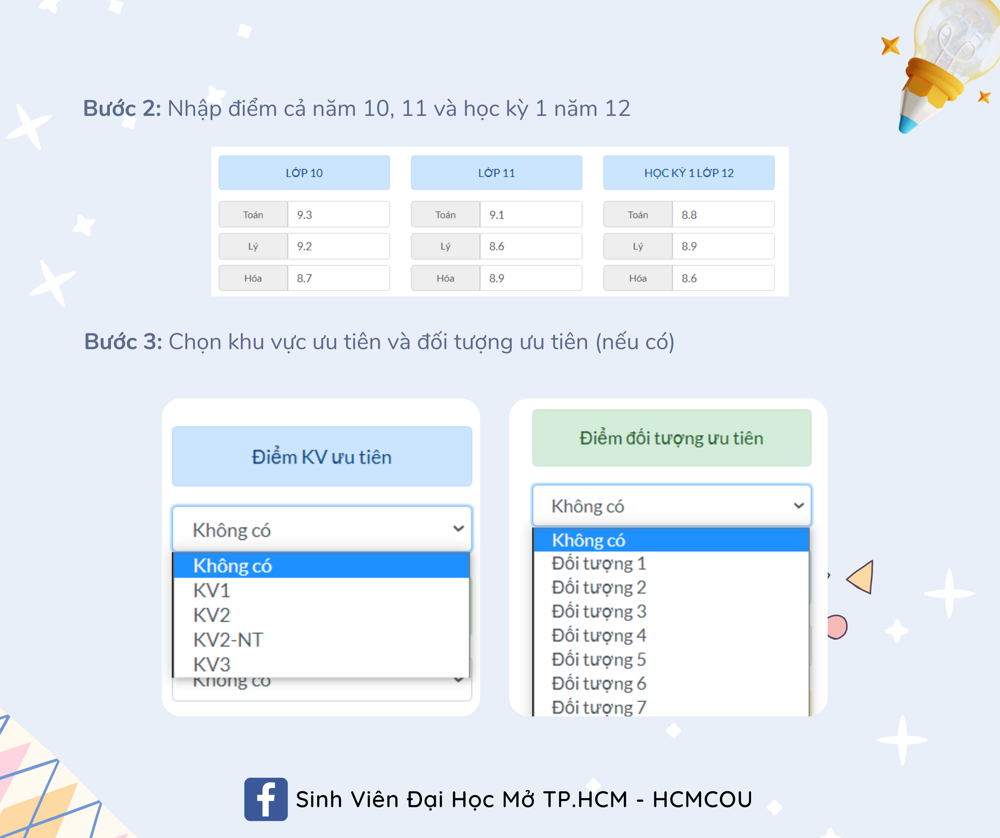

# ℹ Chỉ tiêu - Học phí 2022 & Điểm chuẩn các năm


**Lưu ý:** để thông tin sổ tay bạn nắm được luôn ở trạng thái mới nhất, **sau khi truy cập vào sổ tay này, bạn vui lòng ấn F5 hoặc nút tải lại trang để cập nhật thông tin mới nhất** (vì sổ tay thường xuyên chỉnh sửa nên yêu cầu phải refesh để cập nhật, nếu không thì bạn vẫn đang ở phiên bản cũ, khi đọc có thể sai sót). Xin cảm ơn !!!


📞 **Inbox Fanpage tư vấn tuyển sinh để được hỗ trợ:** [m.me/tuyensinh.ou.edu.vn](https://m.me/tuyensinh.ou.edu.vn)

**🌐 Website tuyển sinh chính thức:** [http://tuyensinh.ou.edu.vn/](http://tuyensinh.ou.edu.vn)

🔗 **Thông tin tuyển sinh Đại học chính quy năm 2022:** [http://tuyensinh.ou.edu.vn/thong-bao-phuong-thuc-uu-tien-xet-tuyen-hoc-sinh-gioi-xet-tuyen-ket-qua-hoc-tap-thpt-hoc-ba-uu-tien-xet-tuyen-ket-qua-hoc-tap-thpt-co-chung-chi-ngoai-ngu-va-uu-tien-xet-tuyen-hoc-sinh-co-chung-chi-quoc-te-](http://tuyensinh.ou.edu.vn/thong-bao-phuong-thuc-uu-tien-xet-tuyen-hoc-sinh-gioi-xet-tuyen-ket-qua-hoc-tap-thpt-hoc-ba-uu-tien-xet-tuyen-ket-qua-hoc-tap-thpt-co-chung-chi-ngoai-ngu-va-uu-tien-xet-tuyen-hoc-sinh-co-chung-chi-quoc-te-)

🔗**Link đăng ký xét tuyển học bạ 2022:** [https://xettuyen.ou.edu.vn/hb2022d1/vi](https://xettuyen.ou.edu.vn/hb2022d1/vi)

**⌚ Thá»i gian xét tuyển:** Từ 09g00 ngày 04/04/2022 đến 17g00 ngày 30/05/2022 

**📌 Hình thức xét:** online (chỉ nhận hồ sơ khi có kết quả trúng tuyển)

**📌 Lệ phí xét tuyển:** miễn phí

**🌐** **Website tính điểm xét tuyển (tham khảo):** [https://namnguyenthanhwork.github.io/oulink/tinh-diem-xet-tuyen](https://namnguyenthanhwork.github.io/oulink/tinh-diem-xet-tuyen)

**🌐** **Website tổng hợp thông tin tuyển sinh (tham khảo):** [https://namnguyenthanhwork.github.io/oulink/index](https://namnguyenthanhwork.github.io/oulink/index)

### Chỉ tiêu tuyển sinh 2022

.png>)

### Điểm chuẩn các năm

.png>)

<mark style="color:yellow;">**Lưu ý:**</mark>

1. Chỉ có cột điểm học bạ là <mark style="color:red;">học sinh giỏi & học sinh khá có thể xét</mark>
2. Chỉ có cột điểm học sinh giỏi là <mark style="color:red;">học sinh giỏi mới được xét, học sinh khá không được xét</mark>
3. Nếu cột học sinh giỏi không có ghi, cột học bạ điền dấu "x" hoặc không điền gì, <mark style="color:red;">nghĩa là tuyển thẳng học sinh giỏi</mark>

### Học phí 1 năm (dự kiến)

### Học phí (theo tín chỉ)

### Học phí chất lượng cao


Tham gia vào nhóm đê ^\_^

